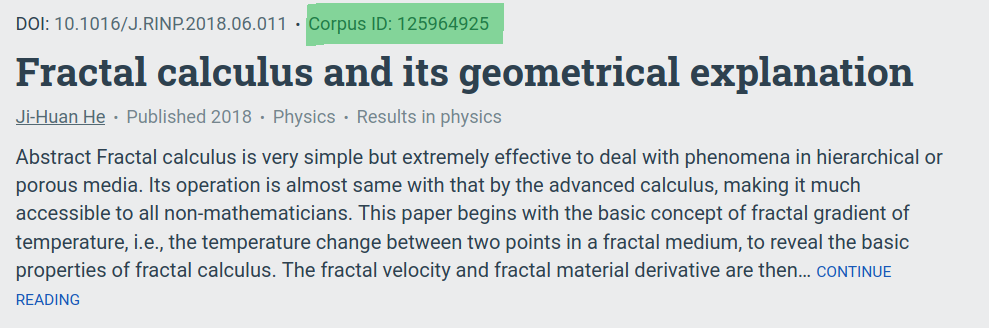

# Citegraph


Generates easily readable citation graphs. This uses the contents
of a bibtex file to determine what you're interested in.

This uses the semanticscholar API to fetch references for articles.


### Installation

* Make sure you have Python 3.6+
* Download or clone this repo
```shell script
$ git clone https://github.com/oowekyala/citegraph.git && cd citegraph
```
* Make sure you have all the required Python packages:
```shell script
$ cat DEPENDENCIES | xargs pip3 install
```
* Add the `bin` directory to you PATH, or just use `bin/citegraph`

### Usage

Find out the ID of an interesting paper on [semanticscholar.org](https://www.semanticscholar.org/),
see for example the highlighted section of this picture:



Remove spaces, and you can pass that ID directly to `citegraph`:

```shell script
$ bin/citegraph CorpusID:125964925
[1 / 80 / 145] (DOI 0.0) Fractal calculus and its geometrical explanation 
[2 / 80 / 145] (DOI 1.25) Fractal approach to heat transfer in silkworm cocoon hierarchy 
...
[80 / 80 / 5602] (DOI 1.428) Bubble Electrospinning for Mass Production of Nanofibers 
Hit max size threshold
Rendering...
Rendered to graph.pdf
```

Here's what the graph would look like (this uses a max `--size` of 20):


Use `citegraph --help` to find out about all the options.

### Layout and export formats

Export formats are selected using the `--format` (`-f`) option.

The following formats are suitable for importing the graph into 
an external graph visualisation tool:
- `gexf`: for [Gephi](https://gephi.org/)
- `dot`: for [Graphviz](https://graphviz.gitlab.io/)

Citegraph can also call Graphviz directly to perform graph 
layout and rendering to another format, for example PDF, PNG,
or SVG. The default export format is PDF, see the available ones 
with `--help`.

### Customizing graph appearance


You can specify how individual nodes are styled with a yaml file.
For example:
```yaml
tags:
    read: # an identifier for the tag
        attrs: # DOT attributes:     https://graphviz.gitlab.io/doc/info/attrs.html
            style: bold
        members: # enumerate explicit members using keys of the bibtex file
            - someBibKey
            - another
    
    knuth_articles: # another tag
        attrs: 
            style: filled
            fillcolor: lightyellow
        
        # Select using an arbitrary python expression
        # The bibtex entry is in scope as 'paper'
        selector: 'any("Knuth" in author.last_names for author in paper.authors)'
```
